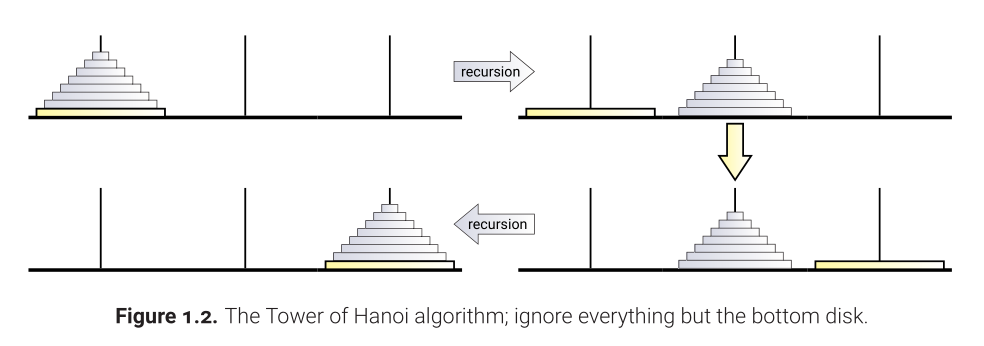

pseudocode:
```
Hanoi(n, src, dst, temp):
    if n > 0:
        Hanoi(n - 1, src, temp, dst)
        move disk n from src to dst
        Hanoi(n - 1, temp, dst, src)
```

Complexity analysis:
T(0) = 0
T(n) = 2T(n-1) + 1
    ==> T(n) = 2^n - 1