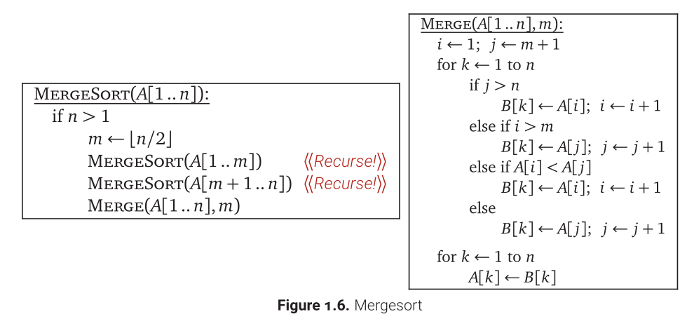

Conceptually, a merge sort works as follows:

1. Divide the unsorted list into n sublists, each containing one element (a list of one element is considered sorted).
2. Repeatedly merge sublists to produce new sorted sublists until there is only one sublist remaining. This will be the sorted list.



Top-down implementation
``` C
// Array A[] has the items to sort; array B[] is a work array.
void TopDownMergeSort(A[], B[], n)
{
    CopyArray(A, 0, n, B);           // one time copy of A[] to B[]
    TopDownSplitMerge(B, 0, n, A);   // sort data from B[] into A[]
}

// Split A[] into 2 runs, sort both runs into B[], merge both runs from B[] to A[]
// iBegin is inclusive; iEnd is exclusive (A[iEnd] is not in the set).
void TopDownSplitMerge(B[], iBegin, iEnd, A[])
{
    if(iEnd - iBegin <= 1)                      // if run size == 1
        return;                                 //   consider it sorted
    // split the run longer than 1 item into halves
    iMiddle = (iEnd + iBegin) / 2;              // iMiddle = mid point
    // recursively sort both runs from array A[] into B[]
    TopDownSplitMerge(A, iBegin,  iMiddle, B);  // sort the left  run
    TopDownSplitMerge(A, iMiddle,    iEnd, B);  // sort the right run
    // merge the resulting runs from array B[] into A[]
    TopDownMerge(B, iBegin, iMiddle, iEnd, A);
}

//  Left source half is A[ iBegin:iMiddle-1].
// Right source half is A[iMiddle:iEnd-1   ].
// Result is            B[ iBegin:iEnd-1   ].
void TopDownMerge(A[], iBegin, iMiddle, iEnd, B[])
{
    i = iBegin, j = iMiddle;
 
    // While there are elements in the left or right runs...
    for (k = iBegin; k < iEnd; k++) {
        // If left run head exists and is <= existing right run head.
        if (i < iMiddle && (j >= iEnd || A[i] <= A[j])) {
            B[k] = A[i];
            i = i + 1;
        } else {
            B[k] = A[j];
            j = j + 1;
        }
    }
}

void CopyArray(A[], iBegin, iEnd, B[])
{
    for(k = iBegin; k < iEnd; k++)
        B[k] = A[k];
}
```

Bottom up
```C
// array A[] has the items to sort; array B[] is a work array
void BottomUpMergeSort(A[], B[], n)
{
    // Each 1-element run in A is already "sorted".
    // Make successively longer sorted runs of length 2, 4, 8, 16... until the whole array is sorted.
    for (width = 1; width < n; width = 2 * width)
    {
        // Array A is full of runs of length width.
        for (i = 0; i < n; i = i + 2 * width)
        {
            // Merge two runs: A[i:i+width-1] and A[i+width:i+2*width-1] to B[]
            // or copy A[i:n-1] to B[] ( if(i+width >= n) )
            BottomUpMerge(A, i, min(i+width, n), min(i+2*width, n), B);
        }
        // Now work array B is full of runs of length 2*width.
        // Copy array B to array A for the next iteration.
        // A more efficient implementation would swap the roles of A and B.
        CopyArray(B, A, n);
        // Now array A is full of runs of length 2*width.
    }
}

//  Left run is A[iLeft :iRight-1].
// Right run is A[iRight:iEnd-1  ].
void BottomUpMerge(A[], iLeft, iRight, iEnd, B[])
{
    i = iLeft, j = iRight;
    // While there are elements in the left or right runs...
    for (k = iLeft; k < iEnd; k++) {
        // If left run head exists and is <= existing right run head.
        if (i < iRight && (j >= iEnd || A[i] <= A[j])) {
            B[k] = A[i];
            i = i + 1;
        } else {
            B[k] = A[j];
            j = j + 1;    
        }
    } 
}

void CopyArray(B[], A[], n)
{
    for(i = 0; i < n; i++)
        A[i] = B[i];
}
```

Analysis:
T(n) = 2*T(n/2) + O(n)
    ==> T(n) = O(nlogn)
