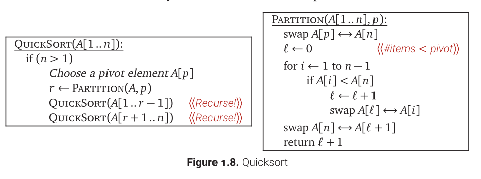

This is known as the Lomuto partition scheme, which is simpler but less efficient than Hoare's original partition scheme.
```
function partition(list, left, right, pivotIndex) is
    pivotValue := list[pivotIndex]
    swap list[pivotIndex] and list[right]  // Move pivot to end
    storeIndex := left
    for i from left to right − 1 do
        if list[i] < pivotValue then
            swap list[storeIndex] and list[i]
            increment storeIndex
    swap list[right] and list[storeIndex]  // Move pivot to its final place
    return storeIndex
```

Hoare partition scheme:
```
algorithm quicksort(A, lo, hi) is
    if lo < hi then
        p := partition(A, lo, hi)
        quicksort(A, lo, p)
        quicksort(A, p + 1, hi)

algorithm partition(A, lo, hi) is
    pivot := A[ floor((hi + lo) / 2) ]
    i := lo - 1
    j := hi + 1
    loop forever
        do
            i := i + 1
        while A[i] < pivot
        do
            j := j - 1
        while A[j] > pivot
        if i ≥ j then
            return j
        swap A[i] with A[j]
```


Analysis:
T(n) = T(r - 1) + T(n - r) + O(n)

1. if we somehow choose pivot to be the median element:
T(n) = T(ceil(n/2) - 1) + T(floor(n / 2)) + O(n) <= 2T(n/2) + O(n)
    ==> T(n) = O(nlogn)

2. if we choose first or last element to be pivot, in worst case the subproblems are completely unbalanced.
T(n) <= T(n - 1) + O(n)
    ==> T(n) = O(n^2)
 