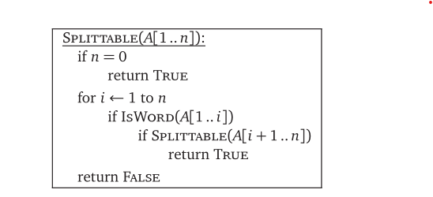
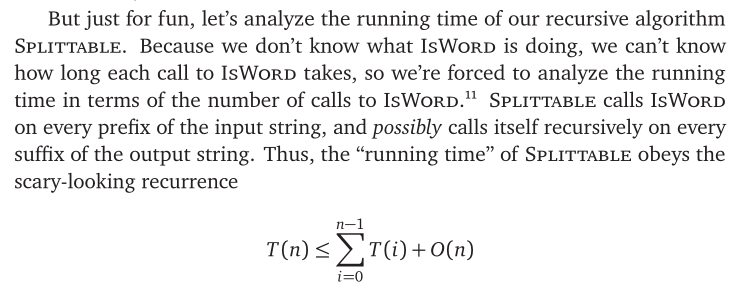
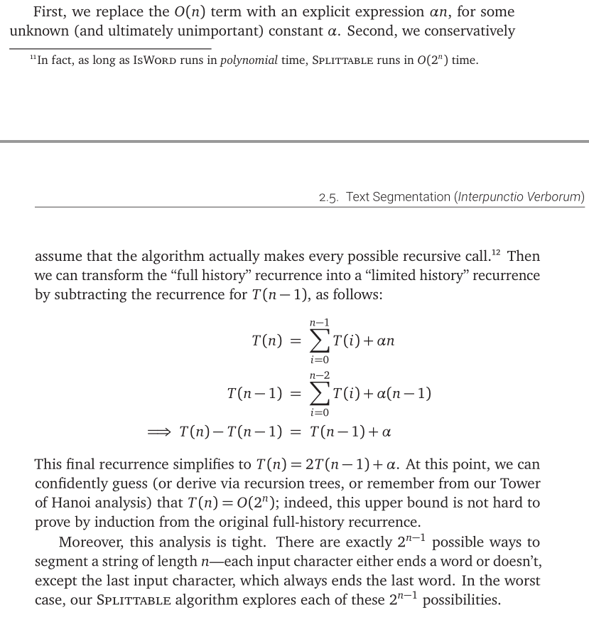

Problem:

Suppose you are given a string of letters representing text in some foreign language, but without any spaces or punctuation, and you want to break this string into its individual constituent words.

Example:

>PRIMVSDIGNITASINTAMTENVISCIENTIANONPOTEST
ESSERESENIMSVNTPARVAEPROPEINSINGVLISLITTERIS
ATQVEINTERPVNCTIONIBUSVERBORVMOCCVPATAE

Algorithm:

Analysis:

