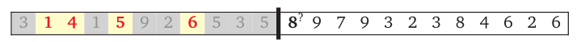

# Definitin of `subsequence`:
>For any sequence S , a subsequence of S is another sequence obtained from S by
deleting zero or more elements, without changing the order of the remaining
elements; the elements of the subsequence need not be contiguous in S

# Problem:

Fine the longest increasing subsequence.

# Example:

