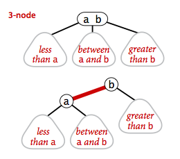
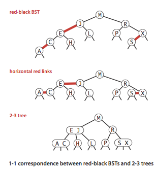
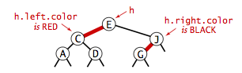
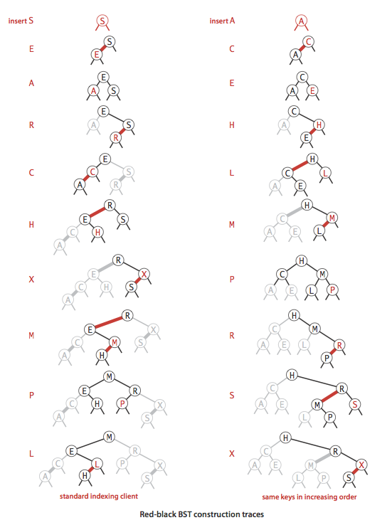

Algorithms 4 2-3 search tree:
>https://algs4.cs.princeton.edu/33balanced/

## Definition. 

A 2-3 search tree is a tree that either is empty or:

A 2-node, with one key (and associated value) and two links, a left link to a 2-3 search tree with smaller keys, and a right link to a 2-3 search tree with larger keys

A 3-node, with two keys (and associated values) and three links, a left link to a 2-3 search tree with smaller keys, a middle link to a 2-3 search tree with keys between the node's keys and a right link to a 2-3 search tree with larger keys.

<figure>
    
</figure>

A perfectly balanced 2-3 search tree (or 2-3 tree for short) is one whose null links are all the same distance from the root.


### Search.

To determine whether a key is in a 2-3 tree, we compare it against the keys at the root: If it is equal to any of them, we have a search hit;
otherwise, we follow the link from the root to the subtree corresponding to the interval of key values that could contain the search key, and then recursively search in that subtree.

<figure>
    
    <figcaption></figcaption>
</figure>

### Insert into a 2-node.

We just replace the node with a 3-node containing its key and the new key to be inserted.


### Insert into a tree consisting of a single 3-node. 

Suppose that we want to insert into a tiny 2-3 tree consisting of just a single 3-node. Such a tree has two keys,
but no room for a new key in its one node. To be able to perform the insertion, we temporarily put the new key into a 4-node,
a natural extension of our node type that has three keys and four links.

Creating the 4-node is convenient because it is easy to convert it into a 2-3 tree made up of three 2-nodes,
one with the middle key (at the root), one with the smallest of the three keys (pointed to by the left link of the root),
and one with the largest of the three keys (pointed to by the right link of the root).


### Insert into a 3-node whose parent is a 2-node.


### Insert into a 3-node whose parent is a 3-node.


### Splitting the root. 

If we have 3-nodes along the whole path from the insertion point to the root, we end up with a temporary 4-node at the root. In this case we split the temporary 4-node into three 2-nodes.


### Local transformations.

The basis of the 2-3 tree insertion algorithm is that all of these transformations are purely local:
No part of the 2-3 tree needs to be examined or modified other than the specified nodes and links.

The number of links changed for each transformation is bounded by a small constant. 
Each of the transformations passes up one of the keys from a 4-node to that nodes parent in the tree,
and then restructures links accordingly, without touching any other part of the tree.

### Global properties. 

These local transformations preserve the global properties that the tree is ordered and balanced: the number of links on the path from the root to any null link is the same.

## Proposition. 
*Search and insert operations in a 2-3 tree with N keys are guaranteed to visit at most lg N nodes.*

## Red-black BSTs. 

The insertion algorithm for 2-3 trees just described is not difficult to understand. We consider a simple representation known as a red-black BST that leads to a natural implementation.

### Encoding 3-nodes.

The basic idea behind red-black BSTs is to encode 2-3 trees by starting with standard BSTs (which are made up of 2-nodes) and adding extra information to encode 3-nodes. We think of the links as being of two different types: red links, which bind together two 2-nodes to represent 3-nodes, and black links, which bind together the 2-3 tree. Specifically, we represent 3-nodes as two 2-nodes connected by a single red link that leans left. We refer to BSTs that represent 2-3 trees in this way as red-black BSTs.

One advantage of using such a representation is that it allows us to use our get() code for standard BST search without modification.




### A 1-1 correspondence.



### Color representation.

Since each node is pointed to by precisely one link (from its parent), we encode the color of links in nodes, by adding a boolean instance variable color to our Node data type, which is true if the link from the parent is red and false if it is black. By convention, null links are black.



### Rotations.

### Flipping colors.

The implementation that we will consider might also allow a black parent to have two red children. The color flip operation flips the colors of the the two red children to black and the color of the black parent to red.

  

### Insert into a single 2-node.
### Insert into a 2-node at the bottom.
### Insert into a tree with two keys (in a 3-node).
### Keeping the root black.
### Insert into a 3-node at the bottom.
### Passing a red link up the tree.

## Implementation. 



## Deletion.

### Proposition.

The height of a red-blackBST with N nodes is no more than 2 lg N.

### Proposition.

In a red-black BST, the following operations take logarithmic time in the worst case: search, insertion, finding the minimum, finding the maximum, floor, ceiling, rank, select, delete the minimum, delete the maximum, delete, and range count.

### Property.

The average length of a path from the root to a node in a red-black BST with N nodes is ~1.00 lg N.

## Implementation in java.

[RedBlackLiteBST.java](https://algs4.cs.princeton.edu/33balanced/RedBlackLiteBST.java.html) is a simpler version that only implement put, get, and contains.

[RedBlackBST.java](https://algs4.cs.princeton.edu/33balanced/RedBlackBST.java.html) :
```java
/******************************************************************************
 *  Compilation:  javac RedBlackBST.java
 *  Execution:    java RedBlackBST < input.txt
 *  Dependencies: StdIn.java StdOut.java  
 *  Data files:   https://algs4.cs.princeton.edu/33balanced/tinyST.txt  
 *    
 *  A symbol table implemented using a left-leaning red-black BST.
 *  This is the 2-3 version.
 *
 *  Note: commented out assertions because DrJava now enables assertions
 *        by default.
 *
 *  % more tinyST.txt
 *  S E A R C H E X A M P L E
 *  
 *  % java RedBlackBST < tinyST.txt
 *  A 8
 *  C 4
 *  E 12
 *  H 5
 *  L 11
 *  M 9
 *  P 10
 *  R 3
 *  S 0
 *  X 7
 *
 ******************************************************************************/

import java.util.NoSuchElementException;

/**
 *  The {@code BST} class represents an ordered symbol table of generic
 *  key-value pairs.
 *  It supports the usual <em>put</em>, <em>get</em>, <em>contains</em>,
 *  <em>delete</em>, <em>size</em>, and <em>is-empty</em> methods.
 *  It also provides ordered methods for finding the <em>minimum</em>,
 *  <em>maximum</em>, <em>floor</em>, and <em>ceiling</em>.
 *  It also provides a <em>keys</em> method for iterating over all of the keys.
 *  A symbol table implements the <em>associative array</em> abstraction:
 *  when associating a value with a key that is already in the symbol table,
 *  the convention is to replace the old value with the new value.
 *  Unlike {@link java.util.Map}, this class uses the convention that
 *  values cannot be {@code null}—setting the
 *  value associated with a key to {@code null} is equivalent to deleting the key
 *  from the symbol table.
 *  <p>
 *  It requires that
 *  the key type implements the {@code Comparable} interface and calls the
 *  {@code compareTo()} and method to compare two keys. It does not call either
 *  {@code equals()} or {@code hashCode()}.
 *  <p>
 *  This implementation uses a <em>left-leaning red-black BST</em>. 
 *  The <em>put</em>, <em>get</em>, <em>contains</em>, <em>remove</em>,
 *  <em>minimum</em>, <em>maximum</em>, <em>ceiling</em>, <em>floor</em>,
 *  <em>rank</em>, and <em>select</em> operations each take
 *  &Theta;(log <em>n</em>) time in the worst case, where <em>n</em> is the
 *  number of key-value pairs in the symbol table.
 *  The <em>size</em>, and <em>is-empty</em> operations take &Theta;(1) time.
 *  The <em>keys</em> methods take
 *  <em>O</em>(log <em>n</em> + <em>m</em>) time, where <em>m</em> is
 *  the number of keys returned by the iterator.
 *  Construction takes &Theta;(1) time.
 *  <p>
 *  For alternative implementations of the symbol table API, see {@link ST},
 *  {@link BinarySearchST}, {@link SequentialSearchST}, {@link BST},
 *  {@link SeparateChainingHashST}, {@link LinearProbingHashST}, and
 *  {@link AVLTreeST}.
 *  For additional documentation, see
 *  <a href="https://algs4.cs.princeton.edu/33balanced">Section 3.3</a> of
 *  <i>Algorithms, 4th Edition</i> by Robert Sedgewick and Kevin Wayne.
 *
 *  @author Robert Sedgewick
 *  @author Kevin Wayne
 */

public class RedBlackBST<Key extends Comparable<Key>, Value> {

    private static final boolean RED   = true;
    private static final boolean BLACK = false;

    private Node root;     // root of the BST

    // BST helper node data type
    private class Node {
        private Key key;           // key
        private Value val;         // associated data
        private Node left, right;  // links to left and right subtrees
        private boolean color;     // color of parent link
        private int size;          // subtree count

        public Node(Key key, Value val, boolean color, int size) {
            this.key = key;
            this.val = val;
            this.color = color;
            this.size = size;
        }
    }

    /**
     * Initializes an empty symbol table.
     */
    public RedBlackBST() {
    }

   /***************************************************************************
    *  Node helper methods.
    ***************************************************************************/
    // is node x red; false if x is null ?
    private boolean isRed(Node x) {
        if (x == null) return false;
        return x.color == RED;
    }

    // number of node in subtree rooted at x; 0 if x is null
    private int size(Node x) {
        if (x == null) return 0;
        return x.size;
    } 


    /**
     * Returns the number of key-value pairs in this symbol table.
     * @return the number of key-value pairs in this symbol table
     */
    public int size() {
        return size(root);
    }

   /**
     * Is this symbol table empty?
     * @return {@code true} if this symbol table is empty and {@code false} otherwise
     */
    public boolean isEmpty() {
        return root == null;
    }


   /***************************************************************************
    *  Standard BST search.
    ***************************************************************************/

    /**
     * Returns the value associated with the given key.
     * @param key the key
     * @return the value associated with the given key if the key is in the symbol table
     *     and {@code null} if the key is not in the symbol table
     * @throws IllegalArgumentException if {@code key} is {@code null}
     */
    public Value get(Key key) {
        if (key == null) throw new IllegalArgumentException("argument to get() is null");
        return get(root, key);
    }

    // value associated with the given key in subtree rooted at x; null if no such key
    private Value get(Node x, Key key) {
        while (x != null) {
            int cmp = key.compareTo(x.key);
            if      (cmp < 0) x = x.left;
            else if (cmp > 0) x = x.right;
            else              return x.val;
        }
        return null;
    }

    /**
     * Does this symbol table contain the given key?
     * @param key the key
     * @return {@code true} if this symbol table contains {@code key} and
     *     {@code false} otherwise
     * @throws IllegalArgumentException if {@code key} is {@code null}
     */
    public boolean contains(Key key) {
        return get(key) != null;
    }

   /***************************************************************************
    *  Red-black tree insertion.
    ***************************************************************************/

    /**
     * Inserts the specified key-value pair into the symbol table, overwriting the old 
     * value with the new value if the symbol table already contains the specified key.
     * Deletes the specified key (and its associated value) from this symbol table
     * if the specified value is {@code null}.
     *
     * @param key the key
     * @param val the value
     * @throws IllegalArgumentException if {@code key} is {@code null}
     */
    public void put(Key key, Value val) {
        if (key == null) throw new IllegalArgumentException("first argument to put() is null");
        if (val == null) {
            delete(key);
            return;
        }

        root = put(root, key, val);
        root.color = BLACK;
        // assert check();
    }

    // insert the key-value pair in the subtree rooted at h
    private Node put(Node h, Key key, Value val) { 
        if (h == null) return new Node(key, val, RED, 1);

        int cmp = key.compareTo(h.key);
        if      (cmp < 0) h.left  = put(h.left,  key, val); 
        else if (cmp > 0) h.right = put(h.right, key, val); 
        else              h.val   = val;

        // fix-up any right-leaning links
        if (isRed(h.right) && !isRed(h.left))      h = rotateLeft(h);
        if (isRed(h.left)  &&  isRed(h.left.left)) h = rotateRight(h);
        if (isRed(h.left)  &&  isRed(h.right))     flipColors(h);
        h.size = size(h.left) + size(h.right) + 1;

        return h;
    }

   /***************************************************************************
    *  Red-black tree deletion.
    ***************************************************************************/

    /**
     * Removes the smallest key and associated value from the symbol table.
     * @throws NoSuchElementException if the symbol table is empty
     */
    public void deleteMin() {
        if (isEmpty()) throw new NoSuchElementException("BST underflow");

        // if both children of root are black, set root to red
        if (!isRed(root.left) && !isRed(root.right))
            root.color = RED;

        root = deleteMin(root);
        if (!isEmpty()) root.color = BLACK;
        // assert check();
    }

    // delete the key-value pair with the minimum key rooted at h
    private Node deleteMin(Node h) { 
        if (h.left == null)
            return null;

        if (!isRed(h.left) && !isRed(h.left.left))
            h = moveRedLeft(h);

        h.left = deleteMin(h.left);
        return balance(h);
    }


    /**
     * Removes the largest key and associated value from the symbol table.
     * @throws NoSuchElementException if the symbol table is empty
     */
    public void deleteMax() {
        if (isEmpty()) throw new NoSuchElementException("BST underflow");

        // if both children of root are black, set root to red
        if (!isRed(root.left) && !isRed(root.right))
            root.color = RED;

        root = deleteMax(root);
        if (!isEmpty()) root.color = BLACK;
        // assert check();
    }

    // delete the key-value pair with the maximum key rooted at h
    private Node deleteMax(Node h) { 
        if (isRed(h.left))
            h = rotateRight(h);

        if (h.right == null)
            return null;

        if (!isRed(h.right) && !isRed(h.right.left))
            h = moveRedRight(h);

        h.right = deleteMax(h.right);

        return balance(h);
    }

    /**
     * Removes the specified key and its associated value from this symbol table     
     * (if the key is in this symbol table).    
     *
     * @param  key the key
     * @throws IllegalArgumentException if {@code key} is {@code null}
     */
    public void delete(Key key) { 
        if (key == null) throw new IllegalArgumentException("argument to delete() is null");
        if (!contains(key)) return;

        // if both children of root are black, set root to red
        if (!isRed(root.left) && !isRed(root.right))
            root.color = RED;

        root = delete(root, key);
        if (!isEmpty()) root.color = BLACK;
        // assert check();
    }

    // delete the key-value pair with the given key rooted at h
    private Node delete(Node h, Key key) { 
        // assert get(h, key) != null;

        if (key.compareTo(h.key) < 0)  {
            if (!isRed(h.left) && !isRed(h.left.left))
                h = moveRedLeft(h);
            h.left = delete(h.left, key);
        }
        else {
            if (isRed(h.left))
                h = rotateRight(h);
            if (key.compareTo(h.key) == 0 && (h.right == null))
                return null;
            if (!isRed(h.right) && !isRed(h.right.left))
                h = moveRedRight(h);
            if (key.compareTo(h.key) == 0) {
                Node x = min(h.right);
                h.key = x.key;
                h.val = x.val;
                // h.val = get(h.right, min(h.right).key);
                // h.key = min(h.right).key;
                h.right = deleteMin(h.right);
            }
            else h.right = delete(h.right, key);
        }
        return balance(h);
    }

   /***************************************************************************
    *  Red-black tree helper functions.
    ***************************************************************************/

    // make a left-leaning link lean to the right
    private Node rotateRight(Node h) {
        assert (h != null) && isRed(h.left);
        // assert (h != null) && isRed(h.left) &&  !isRed(h.right);  // for insertion only
        Node x = h.left;
        h.left = x.right;
        x.right = h;
        x.color = x.right.color;
        x.right.color = RED;
        x.size = h.size;
        h.size = size(h.left) + size(h.right) + 1;
        return x;
    }

    // make a right-leaning link lean to the left
    private Node rotateLeft(Node h) {
        assert (h != null) && isRed(h.right);
        // assert (h != null) && isRed(h.right) && !isRed(h.left);  // for insertion only
        Node x = h.right;
        h.right = x.left;
        x.left = h;
        x.color = x.left.color;
        x.left.color = RED;
        x.size = h.size;
        h.size = size(h.left) + size(h.right) + 1;
        return x;
    }

    // flip the colors of a node and its two children
    private void flipColors(Node h) {
        // h must have opposite color of its two children
        // assert (h != null) && (h.left != null) && (h.right != null);
        // assert (!isRed(h) &&  isRed(h.left) &&  isRed(h.right))
        //    || (isRed(h)  && !isRed(h.left) && !isRed(h.right));
        h.color = !h.color;
        h.left.color = !h.left.color;
        h.right.color = !h.right.color;
    }

    // Assuming that h is red and both h.left and h.left.left
    // are black, make h.left or one of its children red.
    private Node moveRedLeft(Node h) {
        // assert (h != null);
        // assert isRed(h) && !isRed(h.left) && !isRed(h.left.left);

        flipColors(h);
        if (isRed(h.right.left)) { 
            h.right = rotateRight(h.right);
            h = rotateLeft(h);
            flipColors(h);
        }
        return h;
    }

    // Assuming that h is red and both h.right and h.right.left
    // are black, make h.right or one of its children red.
    private Node moveRedRight(Node h) {
        // assert (h != null);
        // assert isRed(h) && !isRed(h.right) && !isRed(h.right.left);
        flipColors(h);
        if (isRed(h.left.left)) { 
            h = rotateRight(h);
            flipColors(h);
        }
        return h;
    }

    // restore red-black tree invariant
    private Node balance(Node h) {
        // assert (h != null);

        if (isRed(h.right) && !isRed(h.left))    h = rotateLeft(h);
        if (isRed(h.left) && isRed(h.left.left)) h = rotateRight(h);
        if (isRed(h.left) && isRed(h.right))     flipColors(h);

        h.size = size(h.left) + size(h.right) + 1;
        return h;
    }


   /***************************************************************************
    *  Utility functions.
    ***************************************************************************/

    /**
     * Returns the height of the BST (for debugging).
     * @return the height of the BST (a 1-node tree has height 0)
     */
    public int height() {
        return height(root);
    }
    private int height(Node x) {
        if (x == null) return -1;
        return 1 + Math.max(height(x.left), height(x.right));
    }

   /***************************************************************************
    *  Ordered symbol table methods.
    ***************************************************************************/

    /**
     * Returns the smallest key in the symbol table.
     * @return the smallest key in the symbol table
     * @throws NoSuchElementException if the symbol table is empty
     */
    public Key min() {
        if (isEmpty()) throw new NoSuchElementException("calls min() with empty symbol table");
        return min(root).key;
    } 

    // the smallest key in subtree rooted at x; null if no such key
    private Node min(Node x) { 
        // assert x != null;
        if (x.left == null) return x; 
        else                return min(x.left); 
    } 

    /**
     * Returns the largest key in the symbol table.
     * @return the largest key in the symbol table
     * @throws NoSuchElementException if the symbol table is empty
     */
    public Key max() {
        if (isEmpty()) throw new NoSuchElementException("calls max() with empty symbol table");
        return max(root).key;
    } 

    // the largest key in the subtree rooted at x; null if no such key
    private Node max(Node x) { 
        // assert x != null;
        if (x.right == null) return x; 
        else                 return max(x.right); 
    } 


    /**
     * Returns the largest key in the symbol table less than or equal to {@code key}.
     * @param key the key
     * @return the largest key in the symbol table less than or equal to {@code key}
     * @throws NoSuchElementException if there is no such key
     * @throws IllegalArgumentException if {@code key} is {@code null}
     */
    public Key floor(Key key) {
        if (key == null) throw new IllegalArgumentException("argument to floor() is null");
        if (isEmpty()) throw new NoSuchElementException("calls floor() with empty symbol table");
        Node x = floor(root, key);
        if (x == null) throw new NoSuchElementException("argument to floor() is too small");
        else           return x.key;
    }    

    // the largest key in the subtree rooted at x less than or equal to the given key
    private Node floor(Node x, Key key) {
        if (x == null) return null;
        int cmp = key.compareTo(x.key);
        if (cmp == 0) return x;
        if (cmp < 0)  return floor(x.left, key);
        Node t = floor(x.right, key);
        if (t != null) return t; 
        else           return x;
    }

    /**
     * Returns the smallest key in the symbol table greater than or equal to {@code key}.
     * @param key the key
     * @return the smallest key in the symbol table greater than or equal to {@code key}
     * @throws NoSuchElementException if there is no such key
     * @throws IllegalArgumentException if {@code key} is {@code null}
     */
    public Key ceiling(Key key) {
        if (key == null) throw new IllegalArgumentException("argument to ceiling() is null");
        if (isEmpty()) throw new NoSuchElementException("calls ceiling() with empty symbol table");
        Node x = ceiling(root, key);
        if (x == null) throw new NoSuchElementException("argument to ceiling() is too small");
        else           return x.key;  
    }

    // the smallest key in the subtree rooted at x greater than or equal to the given key
    private Node ceiling(Node x, Key key) {  
        if (x == null) return null;
        int cmp = key.compareTo(x.key);
        if (cmp == 0) return x;
        if (cmp > 0)  return ceiling(x.right, key);
        Node t = ceiling(x.left, key);
        if (t != null) return t; 
        else           return x;
    }

    /**
     * Return the key in the symbol table of a given {@code rank}.
     * This key has the property that there are {@code rank} keys in
     * the symbol table that are smaller. In other words, this key is the
     * ({@code rank}+1)st smallest key in the symbol table.
     *
     * @param  rank the order statistic
     * @return the key in the symbol table of given {@code rank}
     * @throws IllegalArgumentException unless {@code rank} is between 0 and
     *        <em>n</em>–1
     */
    public Key select(int rank) {
        if (rank < 0 || rank >= size()) {
            throw new IllegalArgumentException("argument to select() is invalid: " + rank);
        }
        return select(root, rank);
    }

    // Return key in BST rooted at x of given rank.
    // Precondition: rank is in legal range.
    private Key select(Node x, int rank) {
        if (x == null) return null;
        int leftSize = size(x.left);
        if      (leftSize > rank) return select(x.left,  rank);
        else if (leftSize < rank) return select(x.right, rank - leftSize - 1); 
        else                      return x.key;
    }

    /**
     * Return the number of keys in the symbol table strictly less than {@code key}.
     * @param key the key
     * @return the number of keys in the symbol table strictly less than {@code key}
     * @throws IllegalArgumentException if {@code key} is {@code null}
     */
    public int rank(Key key) {
        if (key == null) throw new IllegalArgumentException("argument to rank() is null");
        return rank(key, root);
    } 

    // number of keys less than key in the subtree rooted at x
    private int rank(Key key, Node x) {
        if (x == null) return 0; 
        int cmp = key.compareTo(x.key); 
        if      (cmp < 0) return rank(key, x.left); 
        else if (cmp > 0) return 1 + size(x.left) + rank(key, x.right); 
        else              return size(x.left); 
    } 

   /***************************************************************************
    *  Range count and range search.
    ***************************************************************************/

    /**
     * Returns all keys in the symbol table as an {@code Iterable}.
     * To iterate over all of the keys in the symbol table named {@code st},
     * use the foreach notation: {@code for (Key key : st.keys())}.
     * @return all keys in the symbol table as an {@code Iterable}
     */
    public Iterable<Key> keys() {
        if (isEmpty()) return new Queue<Key>();
        return keys(min(), max());
    }

    /**
     * Returns all keys in the symbol table in the given range,
     * as an {@code Iterable}.
     *
     * @param  lo minimum endpoint
     * @param  hi maximum endpoint
     * @return all keys in the symbol table between {@code lo} 
     *    (inclusive) and {@code hi} (inclusive) as an {@code Iterable}
     * @throws IllegalArgumentException if either {@code lo} or {@code hi}
     *    is {@code null}
     */
    public Iterable<Key> keys(Key lo, Key hi) {
        if (lo == null) throw new IllegalArgumentException("first argument to keys() is null");
        if (hi == null) throw new IllegalArgumentException("second argument to keys() is null");

        Queue<Key> queue = new Queue<Key>();
        // if (isEmpty() || lo.compareTo(hi) > 0) return queue;
        keys(root, queue, lo, hi);
        return queue;
    } 

    // add the keys between lo and hi in the subtree rooted at x
    // to the queue
    private void keys(Node x, Queue<Key> queue, Key lo, Key hi) { 
        if (x == null) return; 
        int cmplo = lo.compareTo(x.key); 
        int cmphi = hi.compareTo(x.key); 
        if (cmplo < 0) keys(x.left, queue, lo, hi); 
        if (cmplo <= 0 && cmphi >= 0) queue.enqueue(x.key); 
        if (cmphi > 0) keys(x.right, queue, lo, hi); 
    } 

    /**
     * Returns the number of keys in the symbol table in the given range.
     *
     * @param  lo minimum endpoint
     * @param  hi maximum endpoint
     * @return the number of keys in the symbol table between {@code lo} 
     *    (inclusive) and {@code hi} (inclusive)
     * @throws IllegalArgumentException if either {@code lo} or {@code hi}
     *    is {@code null}
     */
    public int size(Key lo, Key hi) {
        if (lo == null) throw new IllegalArgumentException("first argument to size() is null");
        if (hi == null) throw new IllegalArgumentException("second argument to size() is null");

        if (lo.compareTo(hi) > 0) return 0;
        if (contains(hi)) return rank(hi) - rank(lo) + 1;
        else              return rank(hi) - rank(lo);
    }


   /***************************************************************************
    *  Check integrity of red-black tree data structure.
    ***************************************************************************/
    private boolean check() {
        if (!isBST())            StdOut.println("Not in symmetric order");
        if (!isSizeConsistent()) StdOut.println("Subtree counts not consistent");
        if (!isRankConsistent()) StdOut.println("Ranks not consistent");
        if (!is23())             StdOut.println("Not a 2-3 tree");
        if (!isBalanced())       StdOut.println("Not balanced");
        return isBST() && isSizeConsistent() && isRankConsistent() && is23() && isBalanced();
    }

    // does this binary tree satisfy symmetric order?
    // Note: this test also ensures that data structure is a binary tree since order is strict
    private boolean isBST() {
        return isBST(root, null, null);
    }

    // is the tree rooted at x a BST with all keys strictly between min and max
    // (if min or max is null, treat as empty constraint)
    // Credit: Bob Dondero's elegant solution
    private boolean isBST(Node x, Key min, Key max) {
        if (x == null) return true;
        if (min != null && x.key.compareTo(min) <= 0) return false;
        if (max != null && x.key.compareTo(max) >= 0) return false;
        return isBST(x.left, min, x.key) && isBST(x.right, x.key, max);
    } 

    // are the size fields correct?
    private boolean isSizeConsistent() { return isSizeConsistent(root); }
    private boolean isSizeConsistent(Node x) {
        if (x == null) return true;
        if (x.size != size(x.left) + size(x.right) + 1) return false;
        return isSizeConsistent(x.left) && isSizeConsistent(x.right);
    } 

    // check that ranks are consistent
    private boolean isRankConsistent() {
        for (int i = 0; i < size(); i++)
            if (i != rank(select(i))) return false;
        for (Key key : keys())
            if (key.compareTo(select(rank(key))) != 0) return false;
        return true;
    }

    // Does the tree have no red right links, and at most one (left)
    // red links in a row on any path?
    private boolean is23() { return is23(root); }
    private boolean is23(Node x) {
        if (x == null) return true;
        if (isRed(x.right)) return false;
        if (x != root && isRed(x) && isRed(x.left))
            return false;
        return is23(x.left) && is23(x.right);
    } 

    // do all paths from root to leaf have same number of black edges?
    private boolean isBalanced() { 
        int black = 0;     // number of black links on path from root to min
        Node x = root;
        while (x != null) {
            if (!isRed(x)) black++;
            x = x.left;
        }
        return isBalanced(root, black);
    }

    // does every path from the root to a leaf have the given number of black links?
    private boolean isBalanced(Node x, int black) {
        if (x == null) return black == 0;
        if (!isRed(x)) black--;
        return isBalanced(x.left, black) && isBalanced(x.right, black);
    } 


    /**
     * Unit tests the {@code RedBlackBST} data type.
     *
     * @param args the command-line arguments
     */
    public static void main(String[] args) { 
        RedBlackBST<String, Integer> st = new RedBlackBST<String, Integer>();
        for (int i = 0; !StdIn.isEmpty(); i++) {
            String key = StdIn.readString();
            st.put(key, i);
        }
        StdOut.println();
        for (String s : st.keys())
            StdOut.println(s + " " + st.get(s));
        StdOut.println();
    }
}
```