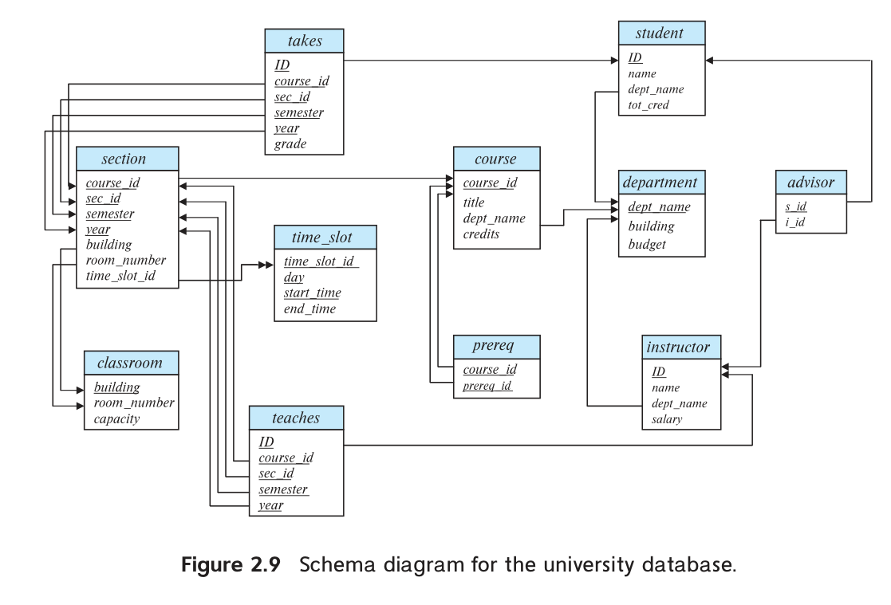
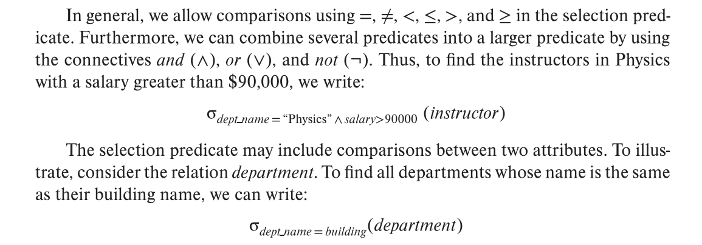
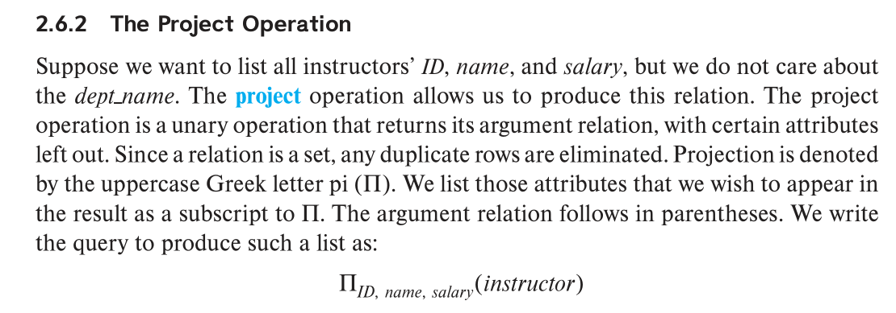
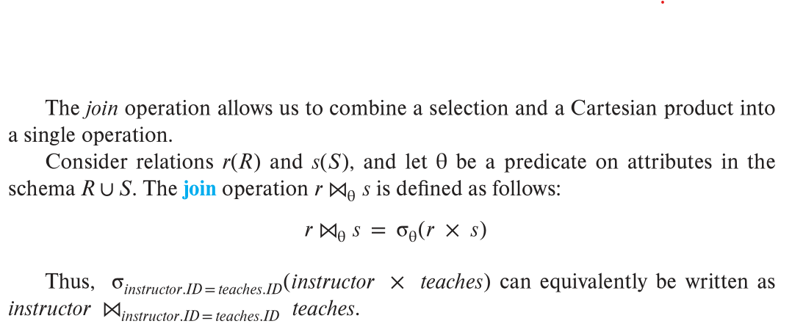
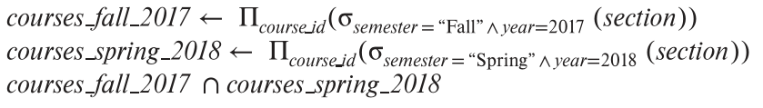
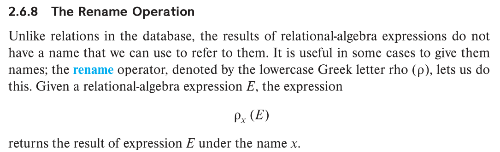

# Concepts

## null

The null value is a special value that signifies that the value is unknown or does not exist. 

## database schema and database instance

When we talk about a database, we must differentiate between the database schema, which is the logical design of the database, and the database instance, which is a snap-shot of the data in the database at a given instant in time.

## super key

A superkey is a set of one or more attributes that, taken collectively, allow us to identify uniquely a tuple in the relation. For example, the ID attribute of the relation instructor is sufficient to distinguish one instructor tuple from another. Thus, ID is a superkey. The name attribute of instructor, on the other hand, is not a superkey, because several instructors might have the same name.

A superkey may contain extraneous attributes. For example, the combination of ID and name is a superkey for the relation instructor. If K is a superkey, then so is any superset of K. We are often interested in superkeys for which no proper subset is a superkey. Such minimal superkeys are called `candidate keys`.

## primary key

We shall use the term primary key to denote a candidate key that is chosen by the database designer as the principal means of identifying tuples within a relation.
The designation of a key represents a constraint in the real-world enterprise being modeled. Thus, primary keys are also referred to as `primary key constraints`.

## foreign key

A `foreign-key constraint` from attribute(s) A of relation r1 to the primary-key B of relation r2 states that on any database instance, the value of A for each tuple in r1 must also be the value of B for some tuple in r2. **Attribute set A is called a `foreign key` from r1, referencing r2. The relation r1 is also called the `referencing relation` of the foreign-key constraint, and r2 is called the `referenced relation`.**

Note that in a `foreign-key constraint`, the referenced attribute(s) must be the pri- mary key of the referenced relation. The more general case, a `referential-integrity constraint`, relaxes the requirement that the referenced attributes form the primary key of the referenced relation.

Note that time_slot does not form a primary key of the time slot relation, although it is a part of the primary key; thus, we cannot use a foreign-key constraint to enforce the above constraint. In fact, foreign-key constraints are a special case of referential integrity constraints, where the referenced attributes form the primary key of the referenced relation. 

Database systems today typically support foreign-key constraints, but they do not support referential integrity constraints where the referenced attribute is not a primary key.

## schema-diagram

A database schema, along with primary key and foreign-key constraints, can be depicted by schema diagrams. Figure 2.9 shows the schema diagram for our university organization. Each relation appears as a box, with the relation name at the top in blue and the attributes listed inside the box.

Primary-key attributes are shown underlined. Foreign-key constraints appear as arrows from the foreign-key attributes of the referencing relation to the primary key of the referenced relation. We use a two-headed arrow, instead of a single-headed arrow, to indicate a referential integrity constraint that is not a foreign-key constraints.

## relational-algebra

### the Select operation

`σ`: select, `∧`: and, `∨`: or, `¬`: not

### the Project operation

### the Cartesian-Production operation

The `Cartesian-product` operation, denoted by a cross (`×`), allows us to combine information from any two relations. We write the Cartesian product of relations *r1* and *r2* as *r1 × r2*.

### the Join operation

### the Set operations

`∪`: Union, `∩`: Intersect, `-` Set difference

### the Assignment operation

The assignment operation, denoted by `←`, works like assignment in a programming language.

### the Rename operation

