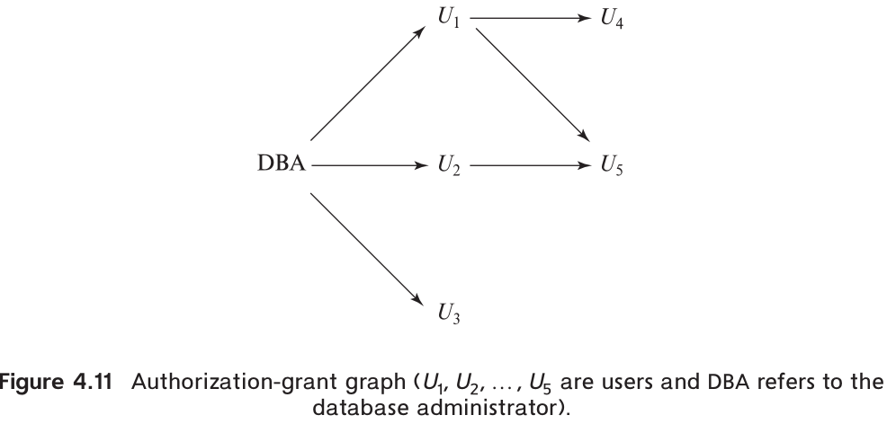

# 1. Join Expressions

## The Natural Join

The `natural join` operation operates on two relations and produces a relation as the
result. Unlike the Cartesian product of two relations, which concatenates each tuple of
the first relation with every tuple of the second, natural join considers only those pairs
of tuples with the same value on those attributes that appear in the schemas of both
relations. 

`natural join` equals `natural inner join`.

```sql
select name, course_id
from student, takes
where student.ID = takes.ID;
```

```sql
select name, course_id
from student natural join takes;
```
the two equries above generate the same result.

## Join Conditions

`join` equals `inner join`

```sql
select *
from student join takes on student.ID = takes.ID;
```

## Outer Joins

The `outer-join` operation works in a manner similar to the join operations we have already studied, but it preserves those tuples that would be lost in a join by creating tuples in the result containing null values.

* The left outer join preserves tuples only in the relation named before (to the left of) the left outer join operation.
* The right outer join preserves tuples only in the relation named after (to the right of) the right outer join operation.
* The full outer join preserves tuples in both relations.

# 2. Views

The form of the create view command is:
```sql
create view v as <query expression>;
```

Example:
```sql
create view faculty as
select ID, name, dept_name
from instructor;
```

## Materialized Views

Definition:
Certain database systems allow view relations to be stored, but they make sure that, if the actual relations used in the view definition change, the view is kept up-to-date. Such views are called `materialized views`.

SQL does not define a standard way of specifying that a view is materialized, but many database systems provide their own SQL extensions for this task. Some database systems always keep materialized views up-to-date when the underlying relations change, while others permit them to become out of date and periodically recompute them.

## Update of a View

In general, an SQL view is said to be updatable (i.e., inserts, updates, or deletes can be applied on the view) if the following conditions are all satisfied by the query defining the view:
* The from clause has only one database relation.
* The select clause contains only attribute names of the relation and does not have any expressions, aggregates, or distinct specification.
* Any attribute not listed in the select clause can be set to null; that is, it does not have a not null constraint and is not part of a primary key.
* The query does not have a group by or having clause.

# 3. Transactions

A transaction consists of a sequence of query and/or update statements. The SQL standard specifies that a transaction begins implicitly when an SQL statement is executed. One of the following SQL statements must end the transaction:
* `Commit work` commits the current transaction; that is, it makes the updates performed by the transaction become permanent in the database. After the transaction is committed, a new transaction is automatically started.
* `Rollback work` causes the current transaction to be rolled back; that is, it undoes all the updates performed by the SQL statements in the transaction. Thus, the database state is restored to what it was before the first statement of the transaction was executed.

Once a transaction has executed commit work, its effects can no longer be undone by rollback work. The database system guarantees that in the event of some failure, such as an error in one of the SQL statements, a power outage, or a system crash, a transaction’s effects will be rolled back if it has not yet executed commit work.
In the case of power outage or other system crash, the rollback occurs when the system restarts.

`Atomic`:
By either committing the actions of a transaction after all its steps are completed, or rolling back all its actions in case the transaction could not complete all its actions successfully, the database provides an abstraction of a transaction as being atomic, that is, indivisible. Either all the effects of the transaction are reflected in the database or none are (after rollback).

# 4. Integrity Constraints

`Integrity constraints` ensure that changes made to the database by authorized users
do not result in a loss of data consistency.

Integrity constraints are usually identified as part of the database schema design process and declared as part of the `create table` command used to create relations.

However, integrity constraints can also be added to an existing relation by using the
command `alter table` *table-name* `add` *constraint*, where constraint can be any constraint on the relation. When such a command is executed, the system first ensures that the relation satisfies the specified constraint. If it does, the constraint is added to the relation; if not, the command is rejected.

## Constraints on a Single Relation

* not null
* unique
* check(<predicate>)

### Not Null Constraint

```sql
name varchar(20) not null
budget numeric(12,2) not null
```

The `not null` constraint prohibits the insertion of a null value for the attribute, and is an example of a `domain constraint`. Any database modification that would cause a null to be inserted in an attribute declared to be not null generates an error diagnostic.

Primary key is automaticly considered not null.

### Unique Constraint

```sql
unique (Aj1, Aj2, … , Ajm)
```

The `unique` specification says that attributes Aj1, Aj2, … , Ajm form a superkey; that is, no
two tuples in the relation can be equal on all the listed attributes.

Special case:
However, attributes declared as unique are permitted to be null unless they have explicitly been declared to be not null. 

### The Check Clause

When applied to a relation declaration, the clause `check(P)` specifies a predicate `P` that must be satisfied by every tuple in a relation.

A common use of the `check` clause is to ensure that attribute values satisfy specified conditions, in effect creating a powerful type system. For instance, a clause check (budget > 0) in the `create table` command for relation department would ensure that the value of budget is nonnegative.

Another example of use of `check` clause:

```sql
create table section
    (course_id varchar (8),
    sec_id varchar (8),
    semester varchar (6),
    year numeric (4,0),
    building varchar (15),
    room_number varchar (7),
    time_slot_id varchar (4),
    primary key (course_id, sec_id, semester, year),
    check (semester in ('Fall', 'Winter', 'Spring', 'Summer')));
```
We use the check clause to simulate an enumerated type by specifying that semester must be one of 'Fall', 'Winter', 'Spring', or 'Summer'. Thus, the check clause permits attribute domains to be restricted in powerful ways that most programming-language type systems do not permit.

Special case:
Null values present an interesting special case in the evaluation of a check clause. A check clause is satisfied if it is not false, so clauses that evaluate to unknown are not violations. If null values are not desired, a separate not null constraint (see Section 4.4.2) must be specified.

Where to place the `check` clause:
A `check` clause may appear on its own, as shown above, or as part of the declaration of an attribute.

Example (`check` clause as part of declaration of an attribute):
```sql
create table department
    (dept_name varchar (20),
    building varchar (15),
    budget numeric (12,2) check (budget > 0),
    primary key (dept_name));
```

Typically, constraints on the value of a single attribute are listed with that attribute, while more complex check clauses are listed separately at the end of a create table statement.


## Referential Integrity (Page 149)

Foreign keys can be specified as part of the SQL `create table` statement by using the `foreign key` clause.

```sql
foreign key (dept_name) references department
```

How to specify foreign key:
By default, in SQL a foreign key references the primary-key attributes of the referenced table. SQL also supports a version of the references clause where a list of attributes of the referenced relation can be specified explicitly.

Example (specify attribute of the referenced relation):
```sql
foreign key (dept_name) references department(dept_name)
```

Requirements for being referenced as foreign key:
The specified list of attributes must, however, be declared as a `superkey` of the referenced relation, using either a `primary key` constraint or a `unique` constraint.


### What happens when referential constaints is violated:

When a referential-integrity constraint is violated, the normal procedure is to reject
the action that caused the violation.However, a foreign key clause can specify that if a delete or update action on the referenced relation violates the constraint, then, instead of rejecting the action, the system must take steps to change the tuple in the referencing relation to restore the
constraint. 

`cascades`:
```sql
create table course
    ( ...
    foreign key (dept_name) references department
                on delete cascade
                on update cascade,
    ...);
```
Because of the clause on delete cascade associated with the foreign-key declaration, if a delete of a tuple in department results in this referential-integrity constraint being violated, the system does not reject the delete. Instead, the delete "`cascades`" to the course relation, deleting the tuple that refers to the department that was deleted. 

Special case (further violation):
If a cascading update or delete causes a constraint violation that cannot be handled by a further cascading operation, the system aborts the transaction.

## Assigning Names to Constraints

To name a constraint, we precede the constraint with the keyword `constraint` and the name we wish to assign it.

```sql
salary numeric(8,2), constraint minsalary check (salary > 29000),
```

Later, if we decide we no longer want this constraint, we can write:

```sql
alter table instructor drop constraint minsalary;
```

## Integrity Constraint Violation During a Transaction (Page 151)

What's the problem:

Transactions may consist of several steps, and integrity constraints may be violated temporarily after one step, but a later step may remove the violation.

How to solve it:

To handle such situations, the SQL standard allows a clause initially deferred to be added to a constraint specification; the constraint would then be checked at the end of a transaction and not at intermediate steps. A constraint can alternatively be specified as deferrable, which means it is checked immediately by default but can be deferred when desired. 

For constraints declared as deferrable, executing a statement set constraints constraint-list deferred as part of a transaction causes the checking of the specified constraints to be deferred to the end of that transaction. 

## Complex Check Conditions and Assertions (Page 152)

Complex check conditions can be useful when we want to ensure the integrity of data, but they may be costly to test.
```sql
check (time_slot_id in (select time_slot_id from time_slot))
```


An `assertion` is a predicate expressing a condition that we wish the database always to satisfy. Consider the following constraints, which can be expressed using assertions.

# 5. SQL Data Types and Schemas (Page 154)

## 1)Date and Time Types in SQL
* date: A calendar date containing a (four-digit) year, month, and day of the month.
* time: The time of day, in hours, minutes, and seconds. A variant, time(p), can be used to specify the number of fractional digits for seconds (the default being 0).
* timestamp: A combination of date and time. A variant, timestamp(p), can be used to specify the number of fractional digits for seconds (the default here being 6). Time-zone information is also stored if with timezone is specified.

## Type Conversion and Formatting Functions

### How to do type conversion:

We can use an expression of the form `cast (e as t)` to convert an expression e to the type t.

MySQL offers a `format` function. Oracle and PostgreSQL offer a set of functions, `to_char`, `to_number`, and `to_date`. SQL Server offers a `convert` function.

###  `coalesce` function to deal with Null values

Definition:
It takes an arbitrary number of arguments, all of which must be of the same type, and returns the first non-null argument.

For example, if we wished to display instructor IDs and salaries but to show null salaries as 0, we would write:

```sql
select ID , coalesce(salary, 0) as salary
from instructor
```

### `decode` function

Definition:
decode (value, match-1, replacement-1, match-2, replacement-2, …, match-N, replacement-N, default-replacement);

It compares value against the match values and if a match is found, it replaces the attribute value with the corresponding replacement value. If no match succeeds, then the attribute value is replaced with the default replacement value.

Example:
```sql
select ID, decode (salary, null, 'N/A', salary) as salary
from instructor
```

## Default Values

```sql
create table student
    (ID varchar (5),
    name varchar (20) not null,
    dept_name varchar (20),
    tot_cred numeric (3,0) default 0,
    primary key (ID));
```

We can omit the attribute `tot_cred` in a insert statement:
```sql
insert into student( ID , name, dept name)
    values ('12789', 'Newman', 'Comp. Sci.');
```

## Large-Object Types

`clob` and `blob`:
SQL provides large-object data types for character data (`clob`) and binary data (`blob`).

```sql
book review clob(10KB)
image blob(10MB)
movie blob(2GB)
```

## User-Defined Types

`distinct types`:
```sql
create type Dollars as numeric(12,2) final;

create table department
    (dept_name varchar (20),
    building varchar (15),
    budget Dollars);
```

Warning:
As a result of strong type checking, the expression (department.budget+20) would not be accepted since the attribute and the integer constant 20 have different types.

`domain`:
SQL hadasimilar but subtly different notion of domain (introduced in SQL-92 ), which can add integrity constraints to an underlying type. 
```sql
create domain DDollars as numeric(12,2) not null;

create domain YearlySalary numeric(8,2)
    constraint salary_value_test check(value >= 29000.00);
```

## Generating Unique Key Values

```sql
ID number(5) generated always as identity
```
When the always option is used, any insert statement must avoid specifying a value for the automatically generated key. To do this, use the syntax for insert in which the attribute order is specified.

If we replace `always` with `by default`, we have the option of specifying our own choice of ID or relying on the system to generate one.

## Create Table Extensions

Motive for `create table ... like ...`:
Applications often require the creation of tables that have the same schema as an existing table.

```sql
create table temp instructor like instructor;
```

Motive for `create table ... as ...`:
When writing a complex query, it is often useful to store the result of a query as a new table.

```sql
create table t1 as
    (select *
    from instructor
    where dept_name = 'Music')
    with data;
```

## Schemas, Catalogs, and Environments

Intro:
Contemporary database systems provide a three-level hierarchy for naming relations. The top level of the hierarchy consists of `catalogs`, each of which
can contain `schemas`.

Each user has a default catalog and schema, and the combination is unique to the user. When a user connects to a database system, the default catalog and schema are set up for the connection; this corresponds to the current directory being set to the user’s home directory when the user logs into an operating system.

To identify a relation uniquely, a three-part name may be used, for example, `catalog5.univ schema.course`.

We may omit the catalog component, in which case the catalog part of the name is
considered to be the default catalog for the connection. Thus, if `catalog5` is the default catalog, we can use univ `schema.course` to identify the same relation uniquely.

With multiple catalogs and schemas available, different applications and different users can work independently without worrying about name clashes. Moreover, multiple versions of an application—one a production version, other test versions—can run on the same database system.

# 6. Index Definition in SQL

Intro & Definition:
An `index` on an attribute of a relation is a data structure that allows the database system to find those tuples in the relation that have a specified value for that attribute efficiently, without scanning through all the tuples of the relation.

Good to know:
Although the syntax that we show is widely used and supported by many database systems, it is not part of the SQL standard. The SQL standard does not support control of the physical database schema; it restricts itself to the logical database schema.

We create an index with the `create index` command, which takes the form:

```sql
create index <index-name> on <relation-name> (<attribute-list>);
```

To define an index named dept index on the instructor relation with dept name as
the search key, we write:

```sql
create index dept index on instructor (dept name);
```

If we wish to declare that the search key is a candidate key, we add the attribute unique to the index definition. Thus, the command:
```sql
create unique index dept index on instructor (dept name);
```

The index name we specified for an index is required to drop an index. The drop index command takes the form:
```sql
drop index <index-name>;
```

# 7. Authorization

## Granting and Revoking of Privileges

`privileges`: select, insert, update, delete.

### grant
The `grant` statement is used to confer authorization.
Basic form of the grant statement:
```sql
grant <privilege list>
on <relation name or view name>
to <user/role list>;
```

Example(grant `Amit` and `Satoshi` select authorization):
```sql
grant select on department to Amit, Satoshi;
```

Exaple(grant update authorization):
```sql
grant update (budget) on department to Amit, Satoshi;
```

Detail about `grant update` and `grant insert`statement:
If update authorization is included in a grant statement, the list of attributes on which update authorization is to be granted optionally appears in parentheses immediately after the update keyword. If the list of attributes is omitted, the update privilege will be granted on all attributes of the relation.

Detail about username `public`:
The user name public refers to all current and future users of the system. Thus, privileges granted to public are implicitly granted to all current and future users.

### revoke

To revoke an authorization, we use the `revoke` statement. It takes a form almost identical to that of grant:
```sql
revoke <privilege list>
on <relation name or view name>
from <user/role list>;
```

Example:
```sql
revoke select on department from Amit, Satoshi;
revoke update (budget) on department from Amit, Satoshi;
```

## Roles

### Introduction of the conecept: `Role`.

Problem:

Granting privileges to users becomes tedious when you have to grant privileges to the same type of users the same privileges whenever a new user is introduced.

Solution:

A better approach would be to specify the authorizations that every instructor is to be given, and to identify separately which database users are instructors. The system can use these two pieces of information to determine the authorizations of each instructor. 

Result:

When a new instructor is hired, a user identifier must be allocated to him, and he must be identified as an instructor. Individual permissions given to instructors need not be specified again.

Definition of `Role`:

The notion of roles captures this concept. A set of roles is created in the database. Authorizations can be granted to roles, in exactly the same fashion as they are granted
to individual users. Each database user is granted a set of roles (which may be empty) that she is authorized to perform.

In our university database, examples of roles could include *instructor, teaching_assistant, student, dean, and department_chair*.

### Detals about `Role`:

Any authorization that can be granted to a user can be granted to a role. Roles are granted to users just as authorizations are.

1.create role.
```sql
    create role instructor;
```

2. grant privileges to role.
```sql
grant select on takes
to instructor;
```

3. grant role to another role, grant role to user.
```sql
create role dean;
grant instructor to dean;
grant dean to Satoshi;
```

Thus, the privileges of a user or a role consist of:
• All privileges directly granted to the user/role.
• All privileges granted to roles that have been granted to the user/role.


## Authorization on Views

## Authorizations on Schema

Intro:
The SQL standard specifies a primitive authorization mechanism for the database schema: 
Only the owner of the schema can carry out any modification to the schema, such as creating or deleting relations, adding or dropping attributes of relations, and adding or dropping indices.

### grant references privilege

SQL includes a references privilege that permits a user to declare foreign keys when creating relations. The SQL references privilege is granted on specific attributes in a manner like that for the update privilege.

```sql
grant references (dept_name) on department to Mariano
```

## Transfer of Privileges

Intro:
A user who has been granted some form of authorization may be allowed to pass on this authorization to other users. 
By default,a user/rolethatis granteda privilege is not authorized to grant that privilege to another user/role.
If we wish to grant a privilege and to allow the recipient to pass the privilege on to other users, we append the `with grant option` clause to the appropriate `grant` command.

Example(grant the authorization to be allowed to pass on the authorization):
```sql
grant select on department to Amit with grant option;
```

## Revoking of Privileges

###  `cascading revocation`

Intro:
Suppose that the database administrator decides to revoke the authorization of user U1. Since U4 has authorization from U1, that authorization should be revoked as well.



As we just saw, revocation of a privilege from a user/role may cause other users/roles also to lose that privilege. This behavior is called `cascading revocation`.

How to avoid `cascading revocation`:

Example:
```sql
revoke select on department from Amit, Satoshi restrict;
```

`strict` doesn't guarentee the execution of the revoke statement:
In this case, the system returns an error if there are any cascading revocations and does not carry out the revoke action.

How to explicitly specify `cascading revocation`:
The keyword `cascade` can be used instead of restrict to indicate that revocation should cascade.


### Problem of `cascading revocation`:

Intro:
Cascading revocation is inappropriate in many situations. Suppose Satoshi has the role of dean, grants instructor to Amit, and later the role dean is revoked from Satoshi (perhaps because Satoshi leaves the university); Amit continues to be employed on the faculty and should retain the instructor role.

Solution:

To deal with this situation, SQL permits a privilege to be granted by a role rather than by a user. 

To grant a privilege with the grantor set to the current role associated with a session, we can add the clause:
```sql
granted by current role
```

Then revoking of roles/privileges from Satoshi will not resulting revoking of roles/privileges from Amit. Even if Satoshi was the user who executed the grant.

## Row-Level Authorization

# Summary

## Join

1. natural join
Natural join provides a simple way to write queries over multiple relations in which a where predicate would otherwise equate attributes with matching names from each relation. This convenience comes at the risk of query seman-
tics changing if a new attribute is added to the schema.

2. inner join

3. outer join, left outer join, right outer join.
Outer join provides a means to retain tuples that, due to a join predicate (whether a natural join, a join-using, or a join-on), would otherwise not appear anywhere in the result relation. The retained tuples are padded with null
values so as to conform to the result schema.

4. join-using

5. join-on
   
## View

View relations can be defined as relations containing the result of queries.

## Transactions

Transactions are sequences of queries and updates that together carry out a task.

## Integrity constraints

Integrity constraints ensure that changes made to the database by authorized users do not result in a loss of data consistency.

## Referential-integrity constraints

Referential-integrity constraints ensure that a value that appears in one relation for a given set of attributes also appears for a certain set of attributes in another relation.

## Domain constraints

Domain constraints specify the set of possible values that may be associated with anattribute. Such constraints may also prohibit the use of null values for particular attributes.

## Index

Indices are important for efficient processing of queries, as well as for efficient enforcement of integrity constraints. Although not part of the SQL standard, SQL commands for creation of indices are supported by most database systems.

## Authorization

SQL authorization mechanisms allow one to differentiate among the users of the database on the type of access they are permitted on various data values in the database.

Roles enable us to assign a set of privileges to a user according to the role that the user plays in the organization.

