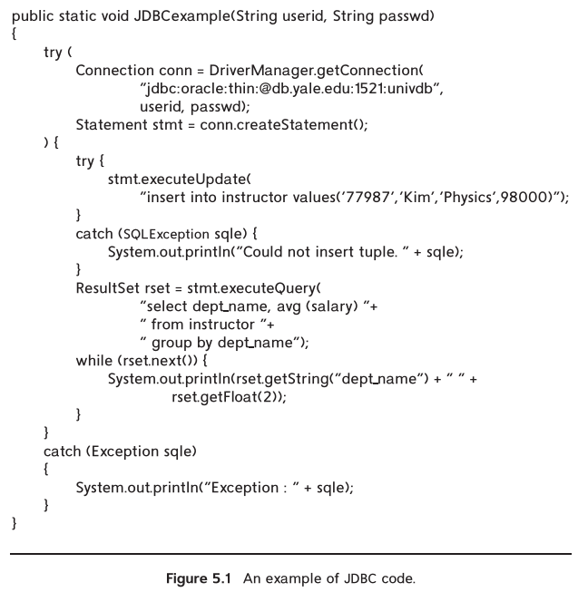
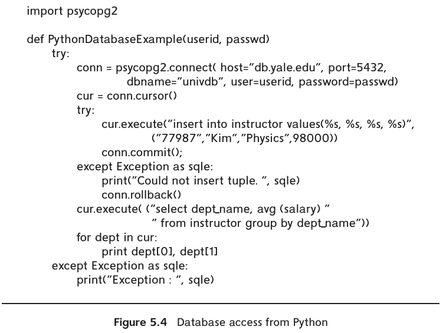
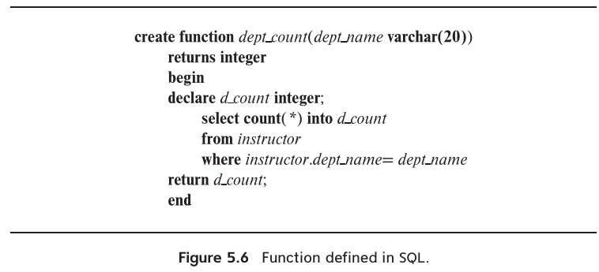

# Introduction

1. In this chapter, we first address the issue of how to access SQL from a general-purpose programming language, which is very important for building applications that use a database to manage data.
2. We then cover some of the more advanced features of SQL starting with how procedural code can be executed within the database either by extending the SQL language to support procedural actions or by allowing functions defined in procedural languages to be executed within the database.
3. We describe triggers, which can be used to specify actions that are to be carriedout automatically on certain events such as insertion, deletion, or update of tuples in a specified relation.
4. Finally, we discuss recursive queries and advanced aggregation features supported by SQL 

# 1. Accessing SQL from a Programming Language

There are two approaches to accessing SQL from a general-purpose programming language:

1. Dynamic SQL: A general-purpose program can connect to and communicate with a database server using a collection of functions (for procedural languages) or methods (for object-oriented languages). Dynamic SQL allows the program to construct an SQL query as a character string at runtime, submit the query, and then retrieve the result into program variables a tuple at a time.
    1. JDBC
    2. ODBC
    3. Python Database API
    4. ADO.NET API, designed for the Visual Basic .NET and C# languages.

2. Embedded SQL: Like dynamic SQL, embedded SQL provides a means by which a program can interact with a database server. However, under embedded SQL, the SQL statements are identified at compile time using a preprocessor, which
translates requests expressed in embedded SQL into function calls.

## 1.1 JDBC

### 1.1.1 Connecting to the Database



### 1.1.2 Shipping SQL Statements to the Database System

To execute a statement, we invoke either the `executeQuery()` method or the `executeUpdate()` method, depending on whether the SQL statement is a query (and, thus, returns a result set) or nonquery statement such as update, insert, delete, or create table.

### 1.1.3 Exceptions and Resource Management

### 1.1.4 Retrieving the Result of a Query

### 1.1.5 Prepared Statements

### 1.1.6 Callable Statements

### 1.1.7 Metadata Features

### 1.1.8 Other Features


## 1.2 Database Access from Python



## 1.3 ODBC

## 1.4 Embedded SQL

# 2. Functions and Procedures

Intro:
In this section, we show how developers can write their own functions and procedures, store them in the database, and then invoke them from SQL statements.

Example:


## 2.1 Declaring and Invoking SQL Functions and Procedures

## 2.2 Language Constructs for Procedures and Functions

## 2.3 External Language Routines

# 3. Triggers

Intro:

A `trigger` is a statement that the system executes automatically as a side effect of a modification to the database. To define a trigger, we must:

1. Specify when a trigger is to be executed. This is broken up into an event that causes the trigger to be checked and a *condition* that must be satisfied for trigger execution to proceed.
2. Specify the *actions* to be taken when the trigger executes.

## 3.1 Need for Triggers

Triggers can be used to implement certain integrity constraints that cannot be speci- fied using the constraint mechanism of SQL.

## 3.2 Triggers in SQL

## 3.3 When Not to Use Triggers

Triggers can serve a very useful purpose, but they are best avoided when alternatives exist. Many trigger applications can be substituted by appropriate use of stored procedures.

# 4. Recursive Queries

# 5. Advanced Aggregation Features

## 5.1 Ranking

```sql
select ID, rank () over (order by GPA desc nulls last) as s rank
from student grades;
```

## 5.2 Windowing

## 5.3 Pivoting

## 5.4 Rollup and Cube


