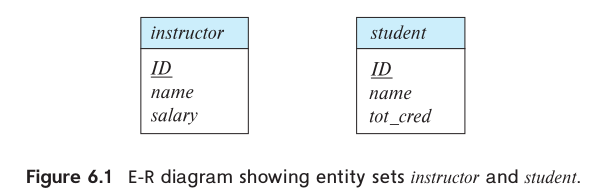
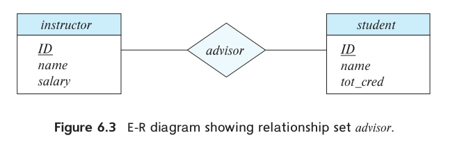
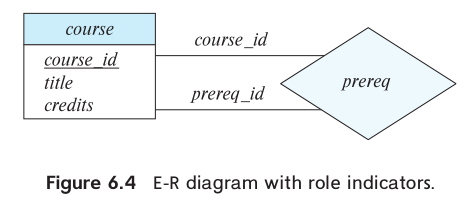
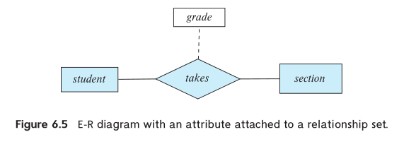

# Intro

In this chapter, we focus on the entity-relationship data model (E-R), which provides a means of identifying entities to be represented in the database and how those entities are related. 

# 1. Overview of the Design Process

The task of creating a database application is a complex one, involving design of the database schema, design of the programs that access and update the data, and design of a security scheme to control access to data.

## 1.1 Design Phases

1. Initial phase. Characterize fully the data needs of the prospective database users.
2. Conceptual design phase. Choose data model, by applying the concepts of the chosen data model, translate these requirments into a conceptual schema of the database. Create the E-R diagram.
3. Functional requirements of the enterprise. In a specification of functional requirements, users describe the kinds of operations (or transactions) that will be performed on the data.
4. Moving from an abstract data model to the implementation of the database.
    1. `Logical-design` phase. The designer maps the high-level conceptual schema onto the implementation data model of the database system that will be used. The implementation data model is typically the relational data model, and this step typically consists of mapping the conceptual schema defined using the entity-relationship model into a relation schema.
    2. `Physical-design` phase. The physical features of the database are specified.  These features include the form of file organization and choice of index structures.

## 1.2 Design Alternatives

Pitfalls to avoid:
1. Redundancy.
2. Incompleteness.

# 2. The Entity-Relationship Mode

The `entity-relationship (E-R) data model` was developed to facilitate database design by allowing specification of an *enterprise schema* that represents the overall logical structure of a database.

## 2.1 Entity Sets

An `entity` is a “thing” or “object” in the real world that is distinguishable from all other objects.

An `entity set` is a set of entities of the same type that share the same properties, or attributes.

An entity is represented by a set of `attributes`. Attributes are descriptive properties possessed by each member of an entity set.

E-R diagram showing entity set:

An `entity set` is represented in an E-R diagram by a rectangle, which is divided into two parts. The first part, which in this text is shaded blue, contains the name of the entity set. The second part contains the names of all the attributes of the entity set.

## 2.2 Relationship Sets

A `relationship` is an association among several entities. 

E-R diagram showing relationship set:

E-R diagram with role indicators:

E-R diagram with attribute attached to a relationship set:

