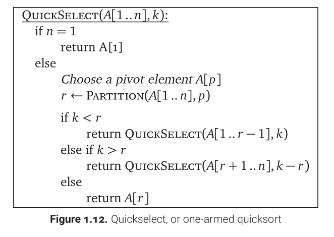
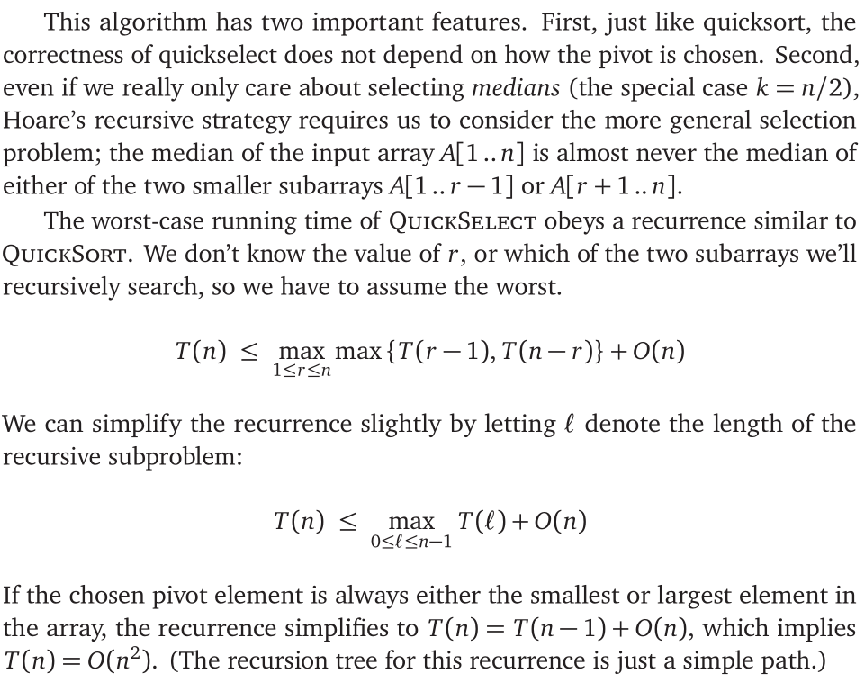
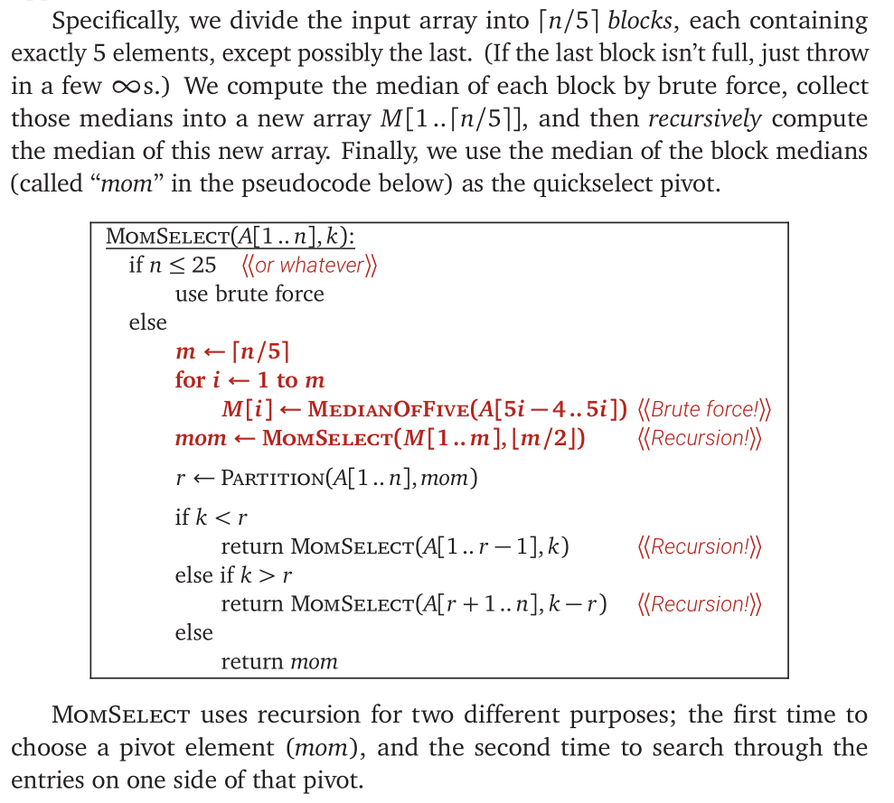
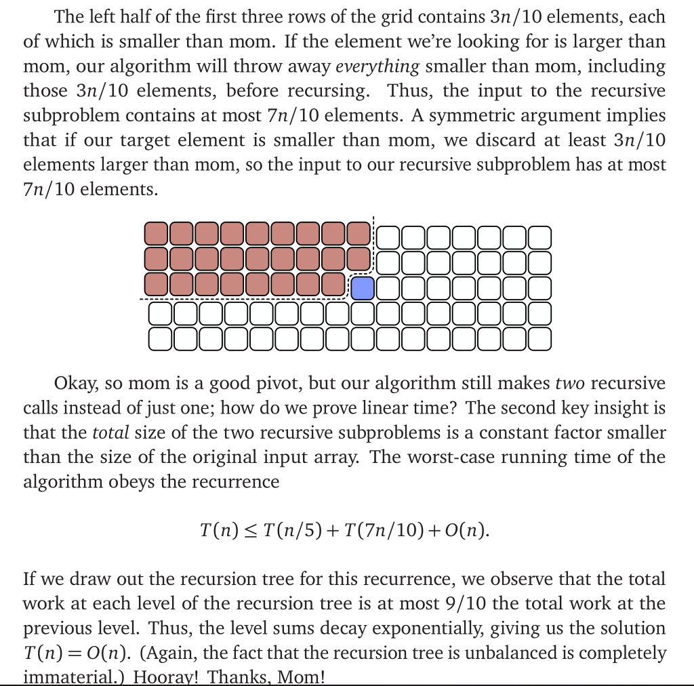
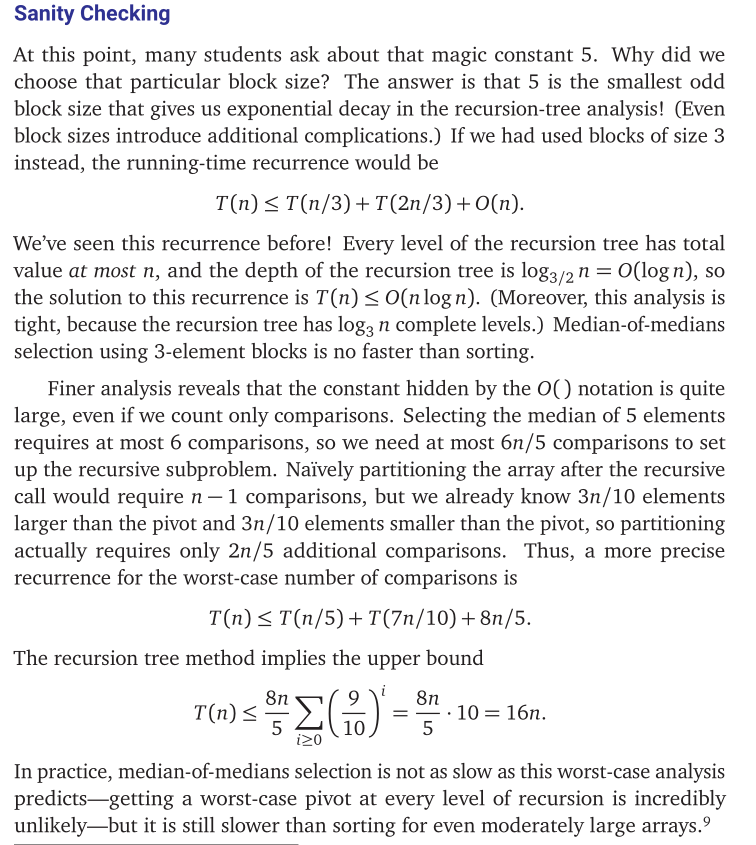

>https://en.wikipedia.org/wiki/Quickselect



Analysis:


"Mom" select:



Analysis:




Worst case analysis:


QuickSelect find the kth largest element:
```python
# Python3 program of Quick Select
 
# Standard partition process of QuickSort().
# It considers the last element as pivot
# and moves all smaller element to left of
# it and greater elements to right
def partition(arr, l, r):
     
    x = arr[r]
    i = l
    for j in range(l, r):
         
        if arr[j] <= x:
            arr[i], arr[j] = arr[j], arr[i]
            i += 1
             
    arr[i], arr[r] = arr[r], arr[i]
    return i
 
# finds the kth position (of the sorted array)
# in a given unsorted array i.e this function
# can be used to find both kth largest and
# kth smallest element in the array.
# ASSUMPTION: all elements in arr[] are distinct
def kthSmallest(arr, l, r, k):
 
    # if k is smaller than number of
    # elements in array
    if (k > 0 and k <= r - l + 1):
 
        # Partition the array around last
        # element and get position of pivot
        # element in sorted array
        index = partition(arr, l, r)
 
        # if position is same as k
        if (index - l == k - 1):
            return arr[index]
 
        # If position is more, recur
        # for left subarray
        if (index - l > k - 1):
            return kthSmallest(arr, l, index - 1, k)
 
        # Else recur for right subarray
        return kthSmallest(arr, index + 1, r,
                            k - index + l - 1)
    return INT_MAX
 
# Driver Code
arr = [ 10, 4, 5, 8, 6, 11, 26 ]
n = len(arr)
k = 3
print("K-th smallest element is ", end = "")
print(kthSmallest(arr, 0, n - 1, k))
 
# This code is contributed by Muskan Kalra.
```